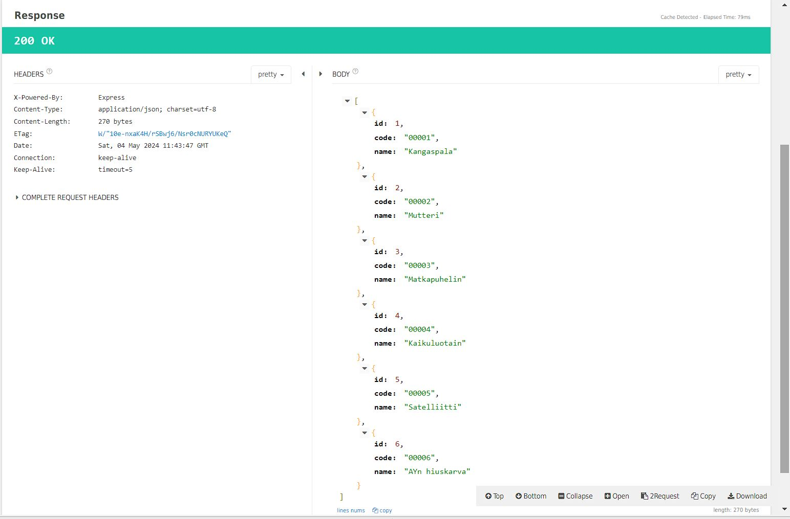
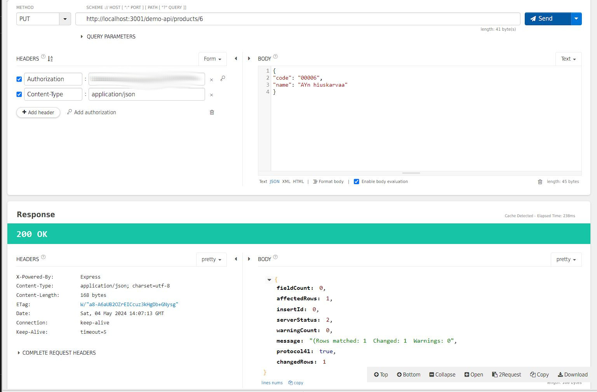
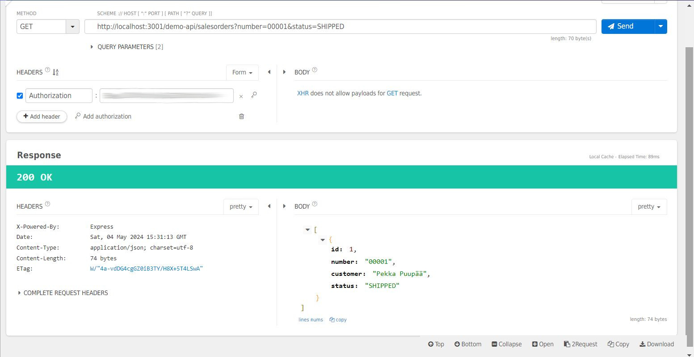

## Readme
* Unlike other subdirectories in coding-samples/, most of the code under this directory isn't mine. Rather this "coding sample" task was all about reading and fixing code, and adding expanding functionalities to existing code. See README in demo-api for further details on the task.
* I've tried to specify the sections of code that are written by me (not including e.g. small bug fixes included in given tasks). Unmarked code should be assumed to be someone else's.

### Task 0.1
* "app" was defined after this line. Moved to before it.
    * const server = http.createServer(app)

### Task 0.2
* Typo in SQL syntax (missing a space).

### Task 1
* Enum was missing option "CANCELLED". Added "CANCELLED" to enum.

### Task 2
* Screenshot of successful GET http://localhost:3001/demo-api/products/ call for my implementation (after a successful POST):

### Task 3

### Task 4
