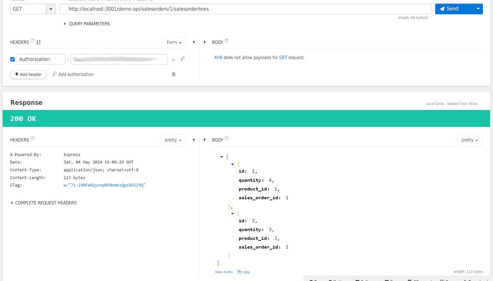
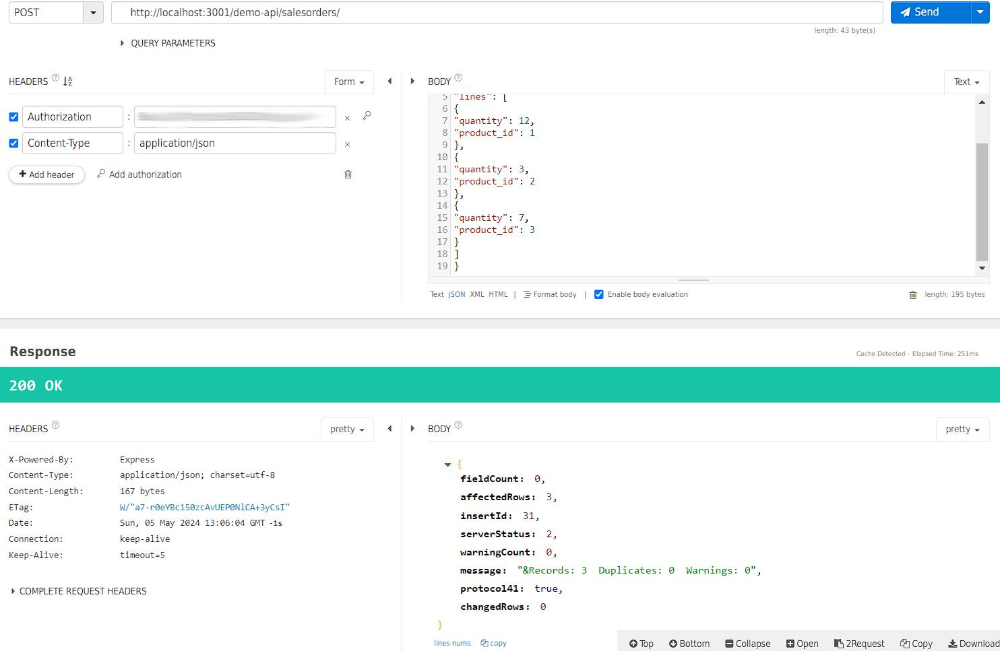

# Readme
* Unlike other subdirectories in coding-samples/, most of the code under this directory isn't mine. Rather this "coding sample" task was all about reading and fixing code, and adding expanding functionalities to existing code. See README in demo-api for further details on the task.
* I've tried to specify the sections of code that are written by me (not including e.g. small bug fixes included in given tasks). Unmarked code should be assumed to be someone else's.
* Proabably could've used more of the included libraries, but it was just simpler to (re)implement some fuctionalities oneself than to familiarize oneself with all the included libraraties (use of other 3rd party libraries was forbidden in tasking).

## Answers to given tasks

### Task 0.1
* "**app**" was defined after the line below. Moved to before the below line.
    * const server = http.createServer(**app**)

### Task 0.2
* Typo in SQL syntax (missing a space).

### Task 1
* Enum was missing option "CANCELLED". Added "CANCELLED" to enum.

### Task 2
* Screenshot of successful GET http://localhost:3001/demo-api/products/ call for my implementation (after a successful POST):

### Task 3
* Added PUT functionality.

### Task 4
* Added using query parameters (if present) with GET.

### Task 5
* Added functionality to get all lines of a sales order to endpoint http://localhost:3001/demo-api/salesorders/id/salesorderlines
    * **id** is the sale order ID to be matched.

### Task 6
* Added functionality to POST to endpoint http://localhost:3001/demo-api/salesorders/id/salesorderlines with included product information.
    * This task requires several SQL calls, which should be separate as to not introduce SQL insertion vulnerabilities. 
    * It was clear from the start that JS's asynchronous calls caused problems, but the task still took a while as I had to refresh myself on JS's Promises to solve the issue.

### Task 7
* Not yet done.

### Task 8
* Table "salesorders" should require "number" to be unique.