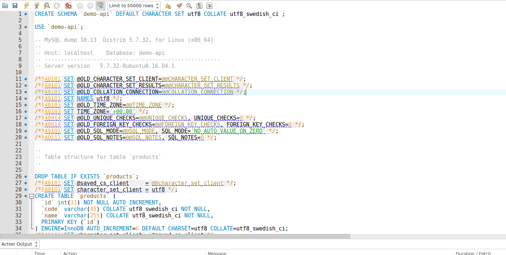
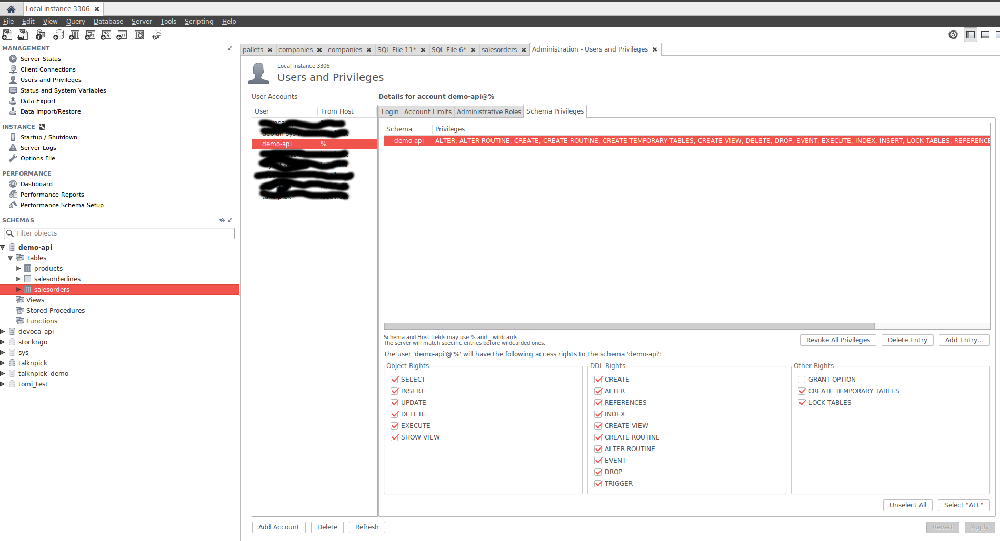
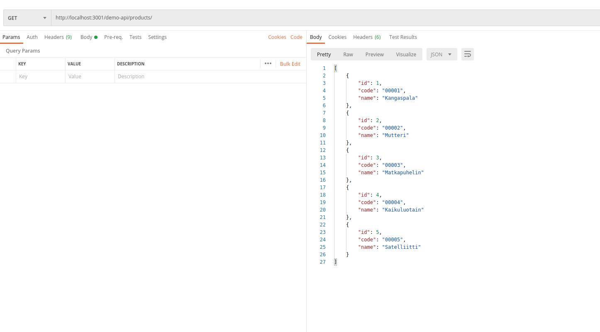

# Devoca Demo REST API assignment

This is a practice assignment that implements a simple REST API.

## Preface
This documents assumes that you use Linux, MySQL Workbench and Postman for testing.
You can use other tools and OS if you so desire. Main goal is to build functioning Node.js REST API.

## Project structure

Demo API has the following endpoints:
* GET   http://localhost:3001/demo-api/salesorders/ (fetches all)
* GET   http://localhost:3001/demo-api/salesorders/:id (fetches one by id)
* POST  http://localhost:3001/demo-api/salesorders/ (creates a new one)


## Database

Copy the contents of *create-db.sql* file to MySQL Workbench and execute commands.



After this you should have a new database called **demo-api** that has following 3 tables:
* products
* salesorders
* salesorderlines

Create a new user that has permissions to the new database.

Give username *demo-api* and password also as *demo-api*.
**ATTN**: Remember to give access rights to new database (*Schema Privileges*).




## Assignment
Familiarize yourself with the source code and database.
You are *NOT* allowed to add any new modules/libraries, you are able to solve this assignment with the modules provided in *package.json*.

Read the assignment and included tasks carefully. Write down following things from each task:

* How did you approach the problem and how did you end up to your solution?

If you get stuck in a certain task just move on to the next one. You don't need to do the tasks in order. Do as many tasks as you are able to.

Return your source code, written answers and modified database as one *zip*-folder.

#### **Start**

Go to the project directory and install needed modules.
```bash
cd demo-api
npm i
```

Start the API 
```bash
node server.js
```

There will be an following error:
```bash
ReferenceError: app is not defined
```

Investigate and fix the error.

After you have fixed the error call *GET http://localhost:3001/demo-api/salesorders/* endpoint.
API is not returning sales orders, instead there's an error. Fix also this error.

#### **Task 1**

You are trying to create a new sales order with the following data:
```bash
POST  http://localhost:3001/demo-api/salesorders/
```
```json
{
    "number": "00006",
    "customer": "Roope Ankka",
    "status": "CANCELLED"
}
```
API gives you an error:
```json
{
    "error": {
        "code": "WARN_DATA_TRUNCATED",
        "errno": 1265,
        "sqlMessage": "Data truncated for column 'status' at row 1",
        "sqlState": "01000",
        "index": 0,
        "sql": "INSERT INTO salesorders (number,customer,status) VALUES ('00006','Roope Ankka','CANCELLED');"
    }
}
```
Research the database and make the necessary changes so the POST call executes successfully.

#### **Task 2**

Create products endpoints. You can check *SalesOrderController* class for help. Products endpoint must provide the same functionality as the *Sales Order* endpoints mentioned beginning of this document.

After this task the REST API supports the following calls:

* GET   http://localhost:3001/demo-api/products/ (fetches all)
* GET   http://localhost:3001/demo-api/products/:id (fetches one by id)
* POST  http://localhost:3001/demo-api/products/ (creates a new one)

Screenshot of successful **GET http://localhost:3001/demo-api/products/** call:



#### **Task 3**

When you check the *BaseController* class you will notice that API doesn't support PUT calls. Implement a solution that updates an existing entity by id.

```javascript
 /* update existing one */
router.put('/' + endpoint + '/:id', function (req, res, next) {
            
});
```

#### **Task 4**

Read the *addDefaultRoutes* method in *BaseController* class that fetches all the entities.

```javascript
 /* get all */
router.get('/' + endpoint, function (req, res, next) {
    const connection = sqlConnection.createConnection();
    const query = 'SELECT * FROM ' + endpoint + ';';
    const response = [];
    connection.query(query, function (error, results, fields) {
        connection.end();
        if (error) next(error);
        res.json(results);
    });
});
```

Change the following part so GET call supports query parameters:
```bash
http://localhost:3001/demo-api/salesorders?number=00001
```
This call should return all the sales orders with number *00001*.

**ATTN**: Remember that URL can have multiple query parameters: 
```bash
http://localhost:3001/demo-api/salesorders?number=00001&status=SHIPPED
```
This should return sales orders with number *00001* **and** status *SHIPPED*

#### **Task 5**

Add endpoint to *SalesOrderController* that returns sales order lines for a specific sales order.
```javascript
addRoutes(endpoint, router) {
    router.get('/' + endpoint + '/:id/salesorderlines', function (req, res, next) {
        /* Tehtävä 5 */
    });
}
```
Succesful GET sales order lines call for sales order id 1:
```bash
http://localhost:3001/demo-api/salesorders/1/salesorderlines
```

#### **Task 6**

Now let's add way to create more sales order lines via sales order endpoint.
The incoming message example:
```bash
POST  http://localhost:3001/demo-api/salesorders/
```
```json
{
    "number": "00010",
    "customer": "Tupu, Hupu ja Lupu",
    "status": "OPEN",
    "lines": [
    	{
    	  	"quantity": 12,
    	  	"product_id": 1
    	},
    	{
    	  	"quantity": 3,
    	  	"product_id": 2
    	},
    	{
    	  	"quantity": 7,
    	  	"product_id": 3
    	}
    ]
}
```


#### **Task 7**

Now add support for updating the sales order and it's lines.
The incoming message looks something like this:
```bash
PUT  http://localhost:3001/demo-api/salesorders/:id
```
```json
{
    "number": "00010",
    "customer": "Tupu, Hupu ja Lupu",
    "status": "BILLED",
    "lines": [
    	{
    		"id": 3,
    	  	"operation": "update",
    	  	"quantity": 13,
    	  	"product_id": 1
    	},
    	{
    	  	"id": 4,
    	  	"operation": "delete",
    	},
    	{
    	  	"operation": "create",
    	  	"quantity": 7,
    	  	"product_id": 2
    	}
    ]
}
```

Sales order lines supports following operations: create, update and delete.


#### **Task 8**
The final task does not include programming, so you can sip your coffee and relax...
This task measures your database design abilities.

Design tables for keeping track products order history.
With these tables we should be able to query data on how many pieces of products have been ordered.

Return SQL file with your table design. Please also provide some test data into your tables. 


