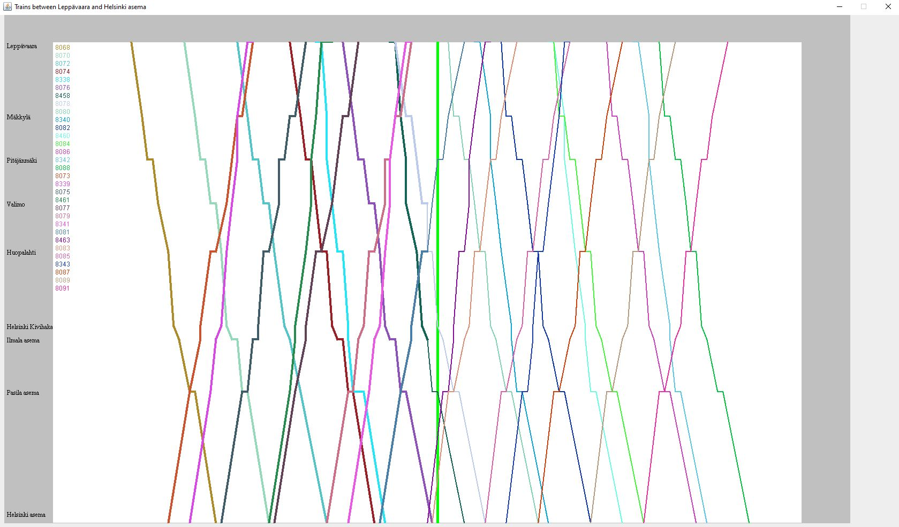

## Train tracking Java app
* Tracks trains between "Leppävaara" and "Helsinki Asema".
* Also tested between "Jyväskylä" and "Äänekoski".
* The two axes represent distance (represented by stations) and time, with the thick green line indicating time now.
* Only shows trains whose timetable entries are within 2(?) hours of current time.
* Copyright the owner of this GitHub account, A-YT. Use for review purposes is allowed.

### Compiling
* To compile the project, you need to add .\lib\json-simple-1.1.1.jar to the project. Other libraries should be standard libraries.
* Use "javac -classpath lib\json-simple-1.1.1.jar "

### Notes and TODOs
* Code would benefit from refactoring. Ran out of time initially.
* Graphs (drawn lines) take into account actual station distances. Station labels don't due to trouble positioning them. That means station labels are somewhat off compared to graph lines (e.g. show when draing a horizontal line, indicating waiting at a station).
* Actual times have been only recently implemented. Currently should draw as a broader line compared to scheduled times, instead of having different graphs.
* Could not find trans names (vs. train numbers) on given API, so showing train numbers.
* Hover over line showing train name not implemented. Not even tried, as API seems to lack train names requested.
* Button to switch axes no implemented due to lack of time / not sure what the added value in changing axes is.
* Current implementation is not realtime, i.e. app doesn't update graph. Unspecified if this feature is needed.
* Labels are slightly out of place. Traingraphs should be pretty accurate.
* Hasn't been tested if used is outside Finnish timezone. Probably doesn't work.
* Train schedule seconds are not used for the graph. This is likely not noticeable, but could in theory in some cases cause something like a 1 pixel distortion. Easy to add seconds if needed.
* For further notes, see source code.

### Example of software running
